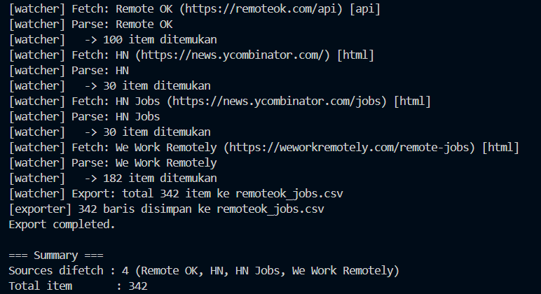
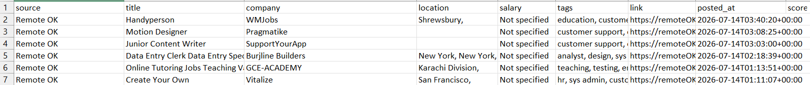
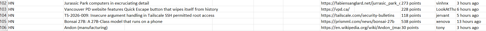
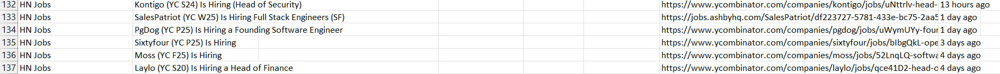
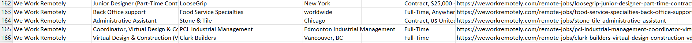

# Remote Job Watcher

A modular Python application that aggregates remote job listings from multiple sources using both **HTML scraping** and **JSON APIs**, then exports them into a unified CSV file.

> Build once, add more sources later.

---

## Overview

Remote Job Watcher is designed to collect remote job opportunities from multiple websites using a modular architecture.

Instead of creating a scraper for a single website, this project provides a reusable framework where each source has its own parser while sharing the same fetcher, exporter, and watcher.

Currently, the project supports both:

- HTML Web Scraping
- JSON API Integration

and exports all collected jobs into a single CSV file.

---

## Features

- 🌐 Multi-source job aggregation
- 📄 HTML scraping using BeautifulSoup
- 🔗 JSON API integration
- 🔁 Automatic retry mechanism
- 📊 Unified CSV export
- 🧩 Modular architecture
- ⚠️ Graceful error handling
- ➕ Easily extendable with new sources

---

## Supported Sources

| Source | Method |
|---------|--------|
| Remote OK | JSON API |
| Hacker News | HTML Scraping |
| Hacker News Jobs | HTML Scraping |
| We Work Remotely | HTML Scraping |

---

## Architecture

```
                Watcher
                   │
      ┌────────────┼────────────┐
      │ │ │
      ▼ ▼ ▼
 Remote OK HN We Work Remotely
   (API) (HTML) (HTML)
      │ │ │
      └────────────┼─────────────┘
                   ▼
             Internal Model
                   ▼
              CSV Exporter
```

---

## Project Structure

```
Remote Job Watcher/
│
├── config.py
├── fetcher.py
├── parser.py
├── exporter.py
├── watcher.py
│
├── output/
│
├── requirements.txt
├── .gitignore
└── README.md
```

---

## Exported Data

Every source is converted into the same internal format.

| Field | Description |
|--------|-------------|
| source | Job source |
| title | Job title |
| company | Company name |
| location | Job location |
| salary | Salary information |
| tags | Technologies / categories |
| link | Original job page |
| posted_at | Publication date |
| score | Popularity (if available) |

---

## Installation

Clone the repository

```bash
git clone https://github.com/nasakautsar/ai_news_monitor.git
```

Install dependencies

```bash
pip install -r requirements.txt
```

Run

```bash
python watcher.py
```

---

## Example Output

Terminal

```
[watcher] Remote OK .......... 100 jobs
[watcher] Hacker News ........ 30 jobs
[watcher] HN Jobs ............ 30 jobs
[watcher] We Work Remotely ... 182 jobs

Total Jobs: 342
```




CSV

```
source,title,company,location,salary,tags,link,posted_at
Remote OK,...
HN,...
We Work Remotely,...
```






---

## Tech Stack

- Python
- Requests
- BeautifulSoup4
- Pandas

---

## Why This Project?

Many job boards expose data differently.

Some provide:

- HTML pages

Others provide:

- JSON APIs

This project demonstrates how a single architecture can support multiple data sources while producing one standardized output format.

---

## Future Improvements

- SQLite database
- Scheduled scraping
- Email notifications
- Web dashboard
- Search & filtering
- Duplicate detection
- Logging to file

---

## License

MIT License

---

## Author

**nasakautsar**

GitHub:
https://github.com/nasakautsar
